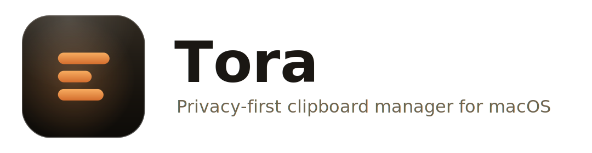

<p align="center">
  <picture>
    <source media="(prefers-color-scheme: dark)" srcset="assets/banner/banner-dark.svg">
    
  </picture>
</p>

# Tora

Everything you copy lands on a deck of cards you can search, pin, organise into
boards, and paste straight back into the app you were using. Local by default,
no telemetry. Built with Electron now, with a pure core designed to power a
React Native iOS app later.

## Install

macOS 11 or later (Apple Silicon or Intel).

> **Testing Tora right now?** The current builds are pre-release and not yet
> notarized, so macOS needs a one-time approval on first launch. Follow
> **[TESTING.md](TESTING.md)** for the exact steps.

The notarized public release (below) installs with no warning and updates itself:

1. Download the latest `Tora-<version>.dmg` from the
   [Releases](https://github.com/mocarram/Tora/releases) page (pick the
   `-arm64` build on Apple Silicon, the unsuffixed build on Intel).
2. Open the dmg and drag **Tora** into Applications.
3. On first launch, grant **Accessibility** when prompted - it lets Tora paste
   straight back into the app you were using.

Once notarized and published, Tora keeps itself up to date: it checks for new
releases on launch and in the background, downloads them quietly, and shows a
Restart pill when one is ready. (Auto-update is inert in unsigned/test builds.)

## Features

- Captures text, rich text, images, files, URLs, colours, and code, with source
  app and per-type previews (syntax-highlighted code, colour swatches, image
  thumbnails, file sizes, link hosts).
- Consecutive-duplicate dedup, retention from 1 day to unlimited (with a storage
  indicator and an unlimited-history warning).
- Instant fuzzy search across clips, source apps, and board names; full keyboard
  navigation; sub-50ms at 10k+ items.
- Pinboards: named, reorderable, drag a card to add it, items in many boards,
  a default Favourites board, quick type filters.
- Queue paste: select multiple clips and paste them in sequence, keep-formatting
  or force-plain.
- Direct paste into the previously focused app via Accessibility, keep-formatting
  by default with a plain-text modifier.
- Frameless vibrancy panel summoned by a global hotkey (default Cmd+Shift+V),
  plus a resizable full window; menu-bar icon with pause/resume; launch at login.
- Privacy: local by default; concealed/transient content (passwords) is never
  stored; password managers excluded out of the box; optional Touch ID app lock.
  The local store itself is plain SQLite + files, protected by owner-only file
  permissions and (on a standard Mac) FileVault - not app-level encryption.
- Optional end-to-end encrypted sync over iCloud Drive (see `SYNC.md`): synced
  data is AES-256-GCM encrypted on-device before it leaves; the key lives in
  the macOS Keychain.

## Architecture

```
src/
  core/      pure, platform-agnostic TS (model, capture classify, parsers,
             search ranking, sync conflict resolution). No Electron, no Node.
             Unit-tested. Reused by the future iOS app.
  main/      Electron main: clipboard capture, SQLite storage + blob store,
             IPC, global hotkey, windows, menu bar, paste injection, sync.
  preload/   single secure contextBridge surface (window.tora).
  renderer/  React + Vite UI. No direct disk/clipboard access.
  shared/    IPC contract types.
```

Security: `contextIsolation` on, `nodeIntegration` off, `sandbox` on, a strict
CSP, navigation locked down, and exactly one typed IPC surface. The renderer
never touches disk or the clipboard directly.

Docs: `DESIGN.md` (design system), `DATA.md` (schema), `SYNC.md` (sync),
`SUMMARY.md` (decisions + measured perf), `GAPS.md` (stubs + unverified),
`RELEASE.md` (signing/notarization).

### Kept platform-agnostic for iOS

`src/core` has zero Electron or Node imports (enforced by an ESLint rule). The
item model, capture classification, parsers, search ranking, and the entire sync
conflict-resolution model live there. A React Native iOS app would reuse `core/`
as-is and provide its own `SyncController` transport and pasteboard reader; the
SQLite schema and `sync_state` map across unchanged (see `DATA.md`).

## Develop

Requires Node 22+.

```bash
npm install          # downloads the Electron binary; then on macOS:
npm run rebuild      # rebuild better-sqlite3 against the Electron ABI
npm run dev          # launch the app with HMR
npm test             # unit + integration tests (node)
npm run typecheck    # strict TS, node + web projects
npm run lint         # ESLint (strict, no-any, no em dash, core import guard)
npm run build        # typecheck + build main/preload/renderer
npm run size         # check built bundle sizes against bundle-budget.json
npm run dist:mac     # package a .dmg (see RELEASE.md for signing)
```

Branch model and CI gates are in `CONTRIBUTING.md`.

> Headless CI skips the Electron binary by exporting
> `ELECTRON_SKIP_BINARY_DOWNLOAD=1` as a workflow env var (see
> `.github/workflows/ci.yml`); local installs download it normally.

## Status

Implemented and verified per phase; core is pure and tested; the secure Electron
config is in place; the design is custom and documented. The GUI and macOS-native
paths (vibrancy, Accessibility paste, Touch ID, real iCloud, packaging) were
built against local defaults and could not be runtime-verified on the Linux build
host. Every such gap is listed honestly in `GAPS.md`.

## Contributing

Issues and pull requests are welcome. The branch model, commit conventions, and
CI gates are documented in [`CONTRIBUTING.md`](CONTRIBUTING.md).

## License

[MIT](LICENSE) (c) 2026 Mocarram Hossain.
